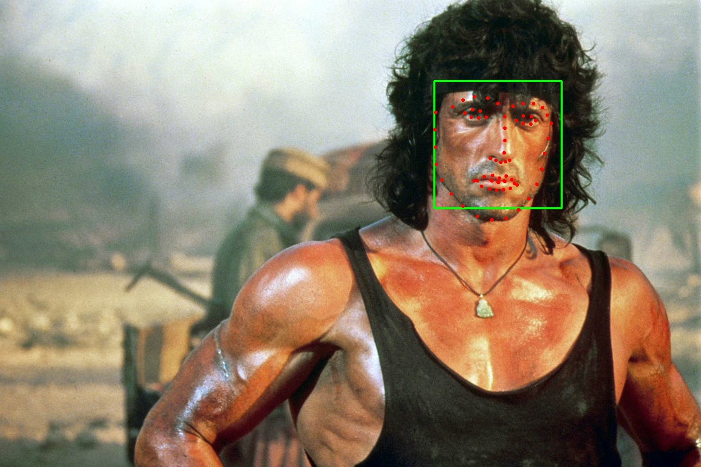
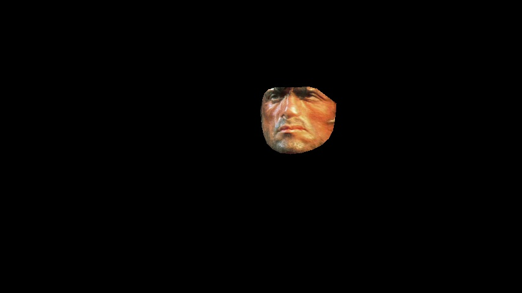
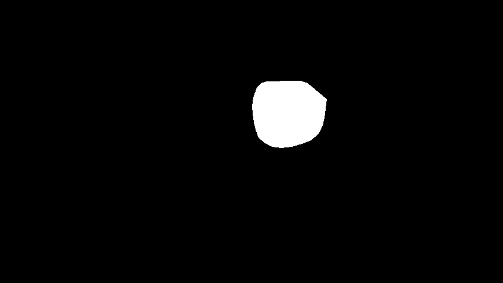

# FaceSwap
The aim of this project is to implement an end-to-end pipeline to swap faces in a video just like [Snapchat's face swap filter](https://www.google.com). We implemented two modes. One is to swap a source face image to a video also with a face. Another one will be swapping two faces in a video.

## Phase 1: Traditional Approach
| | 
|:--:| 
| *Overview of the face replacement pipeline.* |

### 1. Facial landmarks Detection

The first step in the traditional approach is to find facial landmarks. One of the major reasons for using facial landmarks instead of all points on the face is to reduce computational complexity. However, better results can be obtained using all points (dense flow). For facial landmarks detection, we utilized a 68-point facial landmarks detector in `dlib` library that was built into OpenCV.

The figure below shows the result of detected 68-points facial landmarks marked as red points and a green bounding box around the face.

| | 
|:--:|:--:| 
| *Target image of facial landmarks detection.* | *Source image of facial landmarks detection.* |

### 2. Face Wrapping
After we obtain facial landmarks, we need to wrap faces in 3D and one such method is obtained by drawing the dual of the Voronoi diagram, i.e., connecting each two neighboring sites in the Voronoi diagram. This is called the Delaunay Triangulation which tries the maximize the smallest angle in each triangle. The figure below shows the result of the Delaunay Triangulation of the target face image. Next, we will wrap the face using 2 methods: **Triangulation** and **Thin Plate Spline**.

| | 
|:--:| 
| *Delaunay Triangulation on target face we want to swap* | 

#### 2.1. Face Wrapping using Triangulation
Since Delaunay Triangulation tries to maximize the smallest angle in each triangle, we obtained the same triangulation in both images (source and target face images). If we have correspondences between the facial landmarks, we also have correspondences between the triangles. We can make the assumption that in each triangle the content is planar (forms a plane in 3D) and hence the warping between the the triangles in two images is affine.

Now we need to wrap the target face to the source face (we are using inverse warping). The reason for using forward wrapping is that the pixels in the source image are transferred to the target image by computing their new coordinates; this often leads to a nonuniform distribution of "known pixels" in the target image, making it hard to reconstruct. The inverse warping approach is based on finding the corresponding pixel from the source image for every pixel in the target image. This will lead to a better target image at least by exposing the reconstruction problems.

To implement triangulation wrapping, we follow these steps:

1. For each triangle in the target face B, compute the Barycentric coordinate.
2. Compute the corresponding pixel position in the source image A using the barycentric equation but different triangle coordinates.
3. Copy back the value of the pixel at (xA, yA) to the target location.

| | 
|:--:|:--:| 
| *Binary face mask* | *Wraped image using Triangulation* |

#### 2.2. Face Wrapping using Thin Plate Spline
Another way to do the transformation is by using Thin Plate Splines (TPS) which can model arbitrarily complex shapes. We want to compute a TPS that maps form the target feature points in image B to the corresponding source feature points in image A. Note that we need two splines, one for the x coordinate and one for the y. A thin plate spline has the following form:

$$
f(x,y) = a_1 + (a_x)x + (a_y)y + \sum_{i=1}^p{w_i U\left( \vert \vert (x_i,y_i) - (x,y)\vert \vert_1\right)}
$$

Here, $$ U(r) = r^2\log (r^2 )$$

Note that, again in this case we are performing inverse warping. Warping using a TPS is performed in two following steps:

1. We will estimate the parameters of the TPS. The solution of the TPS model rquires solving the following equation:

$$
 \begin{bmatrix} K & P \\ P^T & 0 \\ \end{bmatrix} 
  \begin{bmatrix} w_1 \\ w_2 \\ \vdots \\ w_p \\ a_x \\ a_y \\ a_1  \end{bmatrix}  =
  \begin{bmatrix} v_1 \\ v_2 \\ \vdots \\ v_p \\ 0 \\ 0 \\ 0 \end{bmatrix}  
$$

2. In the second step, use the estimated parameters of the TPS models (both x and y directions), and transform all pixels in target image B by the TPS model. Now, read back the pixel value from source image A directly. The position of the pixels in image A is generated by the TPS equation.

| | 
|:--:|:--:| 
| *Binary face mask* | *Wraped image using TPS* |

### Face Replacement and Blending
In this part, we simply take all the pixels from the face in source image A, wrap them to fit target face B, and replace the pixels. However, the replaced pixels will not look natural as the lighting and edges look different. Therefore we need to blend the wrapped face.

We followed a method called Poisson Blending to blend the warped face onto the target face B. The built-in function in OpenCV `cv2.seamlessClone()` was applied in this project.

## Phase 2: Deep Learning Approach
In this section, we implemented a deep learning network proposed by Feng et al., in a research work titled ”Joint 3D Face Reconstruction and Dense Alignment with Position Map Regression Network”. In the research, they computed a 2D UV position map which records the 3D shape of a complete face, then train a simple CNN to regress it from a single 2D image. The network will output the face of 3D mesh and 68-points facial landmarks. We utilized these outputs to replace the faces in videos.

## Visualization
In the following images, we represent our results of comparison of Triangulation, TPS, and PRNet.
### Replace a Face in a Video to another
<table>
  <tr>
    <td align="center">
       
      Original Video
    </td>
    <td align="center">
       
      Face Wrapping using Triangulation
    </td>
  </tr>
  <tr>
    <td align="center">
       
      Face Wrapping using Plate Spline 
    </td>
    <td align="center">
       
      Face Wrapping using PRNet
    </td>
  </tr>
</table>

### Swap Two Faces in a Video

<table>
  <tr>
    <td align="center">
       
      Original Video
    </td>
    <td align="center">
       
      Face Wrapping using Triangulation
    </td>
  </tr>
  <tr>
    <td align="center">
       
      Face Wrapping using Plate Spline 
    </td>
    <td align="center">
       
      Face Wrapping using PRNet
    </td>
  </tr>
</table>

## References
- CMSC 733: Computer Processing of Visual Information. (2024). Project 2. Retrieved from https://cmsc733.github.io/2022/proj/p2/
- Black, M. (n.d.). Inverse Warper. University of North Carolina at Chapel Hill. Retrieved from https://www.cs.unc.edu/~ibr/src/InverseWarper/
- Feng, Y., Wu, F., Shao, X., Wang, Y., & Zhou, X. (2018). Joint 3d face reconstruction and dense alignment with position map regression network. In Proceedings of the European conference on computer vision (ECCV) (pp. 534-551).
- Feng, Y. (n.d.). PRNet. GitHub. Retrieved from https://github.com/yfeng95/PRNet
