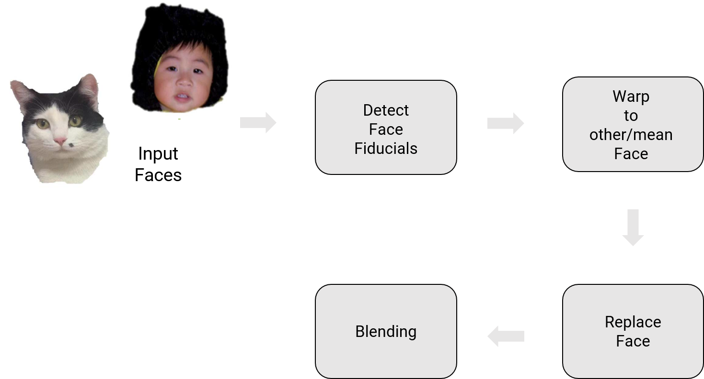
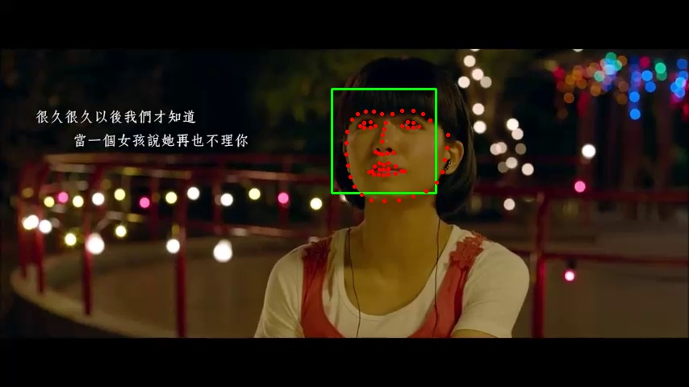
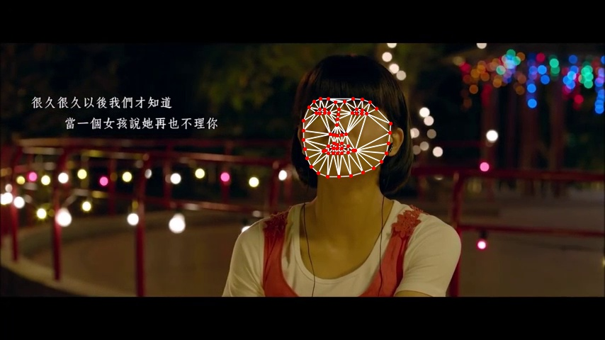

# FaceSwap
The aim of this project is to implement an end-to-end pipline to swap faces in a video just like [Snapchat's face swap filter](https://www.google.com). It is a fairly complicated procedure and variants of the approach that implemented in many movies.

## Phase 1: Traditional Approach
| | 
|:--:| 
| *Overview of the face replacement pipeline.* |

### Facial landmarks Detection

The first step in the traditional approach is to find facial landmarks. One of the major reasons to use facial landmarks instead of using all the key points on the face is to reduce the computational complexity. However, better results can be obtained using all points (dense flow). For facial landmarks detection, we utilized 68-point facial landmarks detector in dlib library that built into OpenCV.

The figure below shows the result of detected 68-points facial landmarks marked as red points and a green bounding box around the face.

| | 
|:--:| 
| * Output of dlib for facial landmarks detection.* |

After we obtained facial landmarks, we need to wrap faces in 3D and one such method is obtained by drawing the dual of the Voronoi diagram, i.e., connecting each two neighboring sites in the Voronoi diagram. This is called the Delaunay Triangulation which tries the maximize the smallest angle in each triangle.

| | 
|:--:| 
| *Delaunay Triangulation on target face we want to swap* |